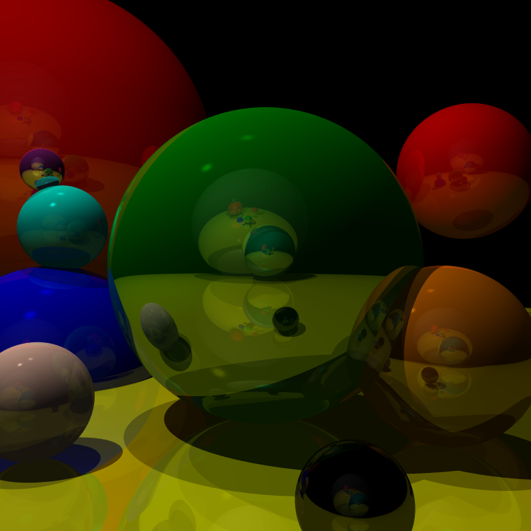

# Raytracing Spheres
A small exploration of 3D rendering of spheres with raytracing algorithms. 

Done by following Peter Shirley's Ray Tracing in One Weekend (https://raytracing.github.io/books/RayTracingInOneWeekend.html) and Gabriel Gambetta's Computer Graphics from Scratch (https://gabrielgambetta.com/computer-graphics-from-scratch/).

Final results:

